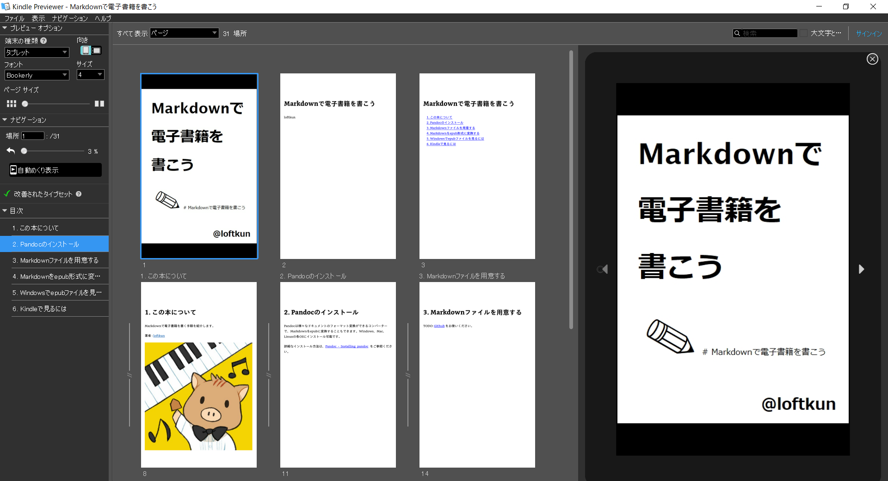

# Markdown to ebook ( epub, kpf, mobi )

## Prerequisites

[Pandoc - Installing pandoc](https://pandoc.org/installing.html)

## Markdown to epub

```bash
$ pandoc --from markdown --to epub3 book.md --output book.epub --toc --epub-cover-image=img/cover.png
```

## epub to kpf or mobi

You can convert using [Kindle Previewer](https://kdp.amazon.co.jp/ja_JP/help/topic/G202131170).



enjoy your ebook!


