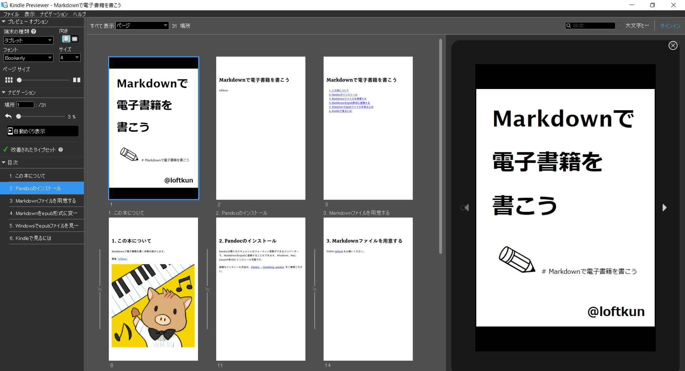

# 1. この本について

Markdownで電子書籍を書く手順を紹介します。この本もMarkdownで書いたものとなります。

著者 : [loftkun](https://twitter.com/loftkun)
リポジトリ : [github.com/loftkun/markdown-to-ebook](https://github.com/loftkun/markdown-to-ebook)


# 2. Pandocのインストール

Pandocは様々なドキュメントのフォーマット変換ができるコンバーターで、Markdownをepubに変換することもできます。Windows、Mac、Linuxの各OSにインストール可能です。

詳細なインストール方法は、[Pandoc - Installing pandoc](https://pandoc.org/installing.html) をご参照ください。

# 3. Markdownファイルを用意する

サンプルとして[github.com/loftkun/markdown-to-ebook](https://github.com/loftkun/markdown-to-ebook)にbook.mdを置いております。

# 4. Markdownをepub形式に変換する

```bash
$ pandoc --from markdown --to epub3 book.md --output book.epub --toc --epub-cover-image=img/cover.png
```

パラメタの意味は以下となります。

|     パラメタ     |          意味          |
| ---------------- | ---------------------- |
| from             | 変換元のフォーマット   |
| to               | 変換先のフォーマット   |
| output           | 出力ファイルのパス     |
| toc              | 目次を出力する         |
| epub-cover-image | 表紙画像ファイルのパス |

# 5. Windowsでepubファイルを見るには

Windowsでepubを見る標準のツールはないようですね(多分)。。<br>

Microsoftのサイトで`epub`で検索するリンクは以下となります、ご参考にされてください。
[https://www.microsoft.com/ja-jp/search?q=epub](https://www.microsoft.com/ja-jp/search?q=epub)

後述の`Kindle Previewer`で見ることもできますが、私は [freda epub ebook reader](https://www.microsoft.com/ja-jp/p/freda-epub-ebook-reader/9wzdncrfj43b?activetab=pivot:overviewtab) を使ってみています。

# 6. Kindleで見るには

kpfもしくはmobi形式に変換してあげるとKindleで見ることができます。Amazonが公開している [Kindle Previewer](https://kdp.amazon.co.jp/ja_JP/help/topic/G202131170) というツールで epub を kpfもしくはmobi に変換できます( ファイル->エクスポートメニュー )。



Kindle端末やKindleアプリで見てみると電子書籍感が出てきますのでおすすめです。


